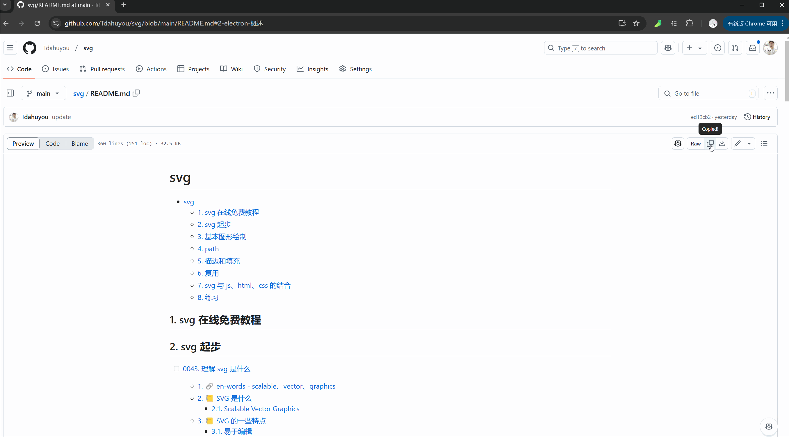
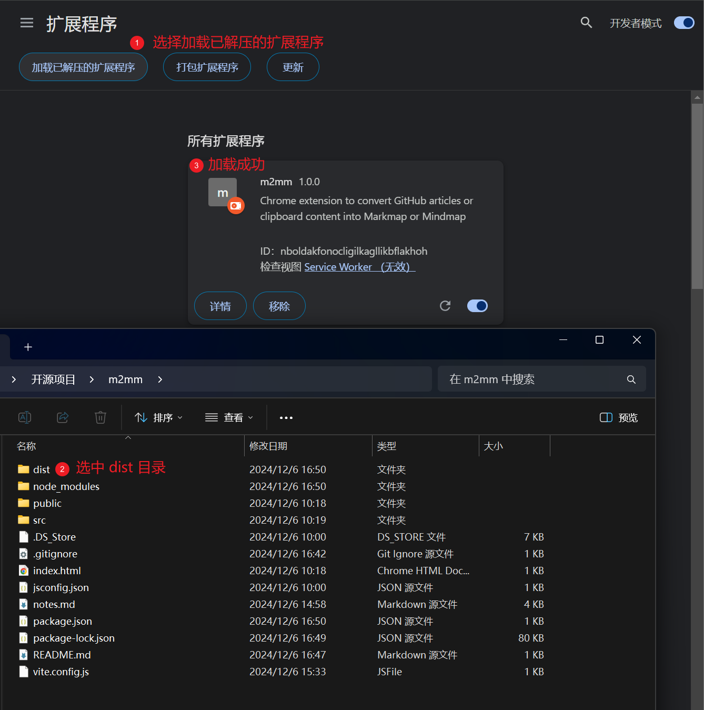

# m2mm

## github page

- https://tdahuyou.github.io/m2mm/

## Introduction

m2mm is a Chrome browser extension that converts Markdown content from the clipboard into a Markmap.

## Usage



## Installation

### npm

```bash
npm run build
```



### chrome extensions

⏰ pending...
