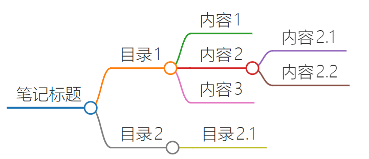
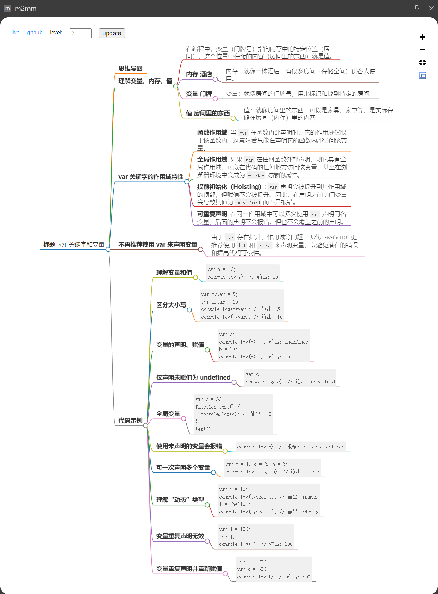

# m2mm

- m2mm（markdown to markmap）是一款将无序列表形式的 markdown 内容转为 markmap 思维导图格式的工具。
- 转换结果是只读的，主要作为预览用。
- 编写 m2mm 的初衷是为了让自己的笔记大纲能够以思维导图的形式来呈现，以便笔记大纲的预览。

## 🔗 在线访问

- https://m2mm.tdahuyou.cn/
- 可在电脑、平板、手机上访问。

## 🔗 chrome 插件

- https://chromewebstore.google.com/detail/m2mm/efagcmmcgdofnhlpajgdpfdmicmkjkda?authuser=0&hl=zh-CN

## 💻 基本使用流程

- 
  - 该截图访问的文档链接：https://notes.tdahuyou.cn/notes/svg.html
- 

## 📦 build

- 可自行根据需求做扩展，clone 代码后直接 build，然后手动加载到 chrome 中调试。

```bash
npm run build
```


## 🤔 m2mm 都有哪些应用场景？

- 只要你的内容是以 markdown 无序列表来编写的，都可以丢到 m2mm 中转换成思维导图的形式。
- 比如你有如下格式的笔记，你可以一键复制，然后丢到 m2mm 中。
```md
- 笔记标题
  - 目录1
    - 内容1
    - 内容2
      - 内容2.1
      - 内容2.2
    - 内容3
  - 目录2
    - 目录2.1
```

- 

----

- 或者在阅读某篇文章时，让 AI 提炼文章内容，并要求 AI 以指定格式返回，比如可以将下面这段内容丢给 chat gpt 4。

```md
https://github.com/Tdahuyou/javascript/blob/main/0001.%20var%20%E5%85%B3%E9%94%AE%E5%AD%97%E5%92%8C%E5%8F%98%E9%87%8F/README.md
请解读这篇文章，并且返回的内容格式要求是 markdown 无序列表的形式，比如：
- 标题
  - 目录1
    - 内容1
    - 内容2
      - 内容2.1
      - 内容2.2
    - 内容3
  - 目录2
    - 目录2.1
```

- 然后将 gpt4 回复的内容粘贴到 m2mm 中：
  - 
- 可以保存一下提问模板，后续每次在提问的时候，只需要更新咨询的文章连接即可。