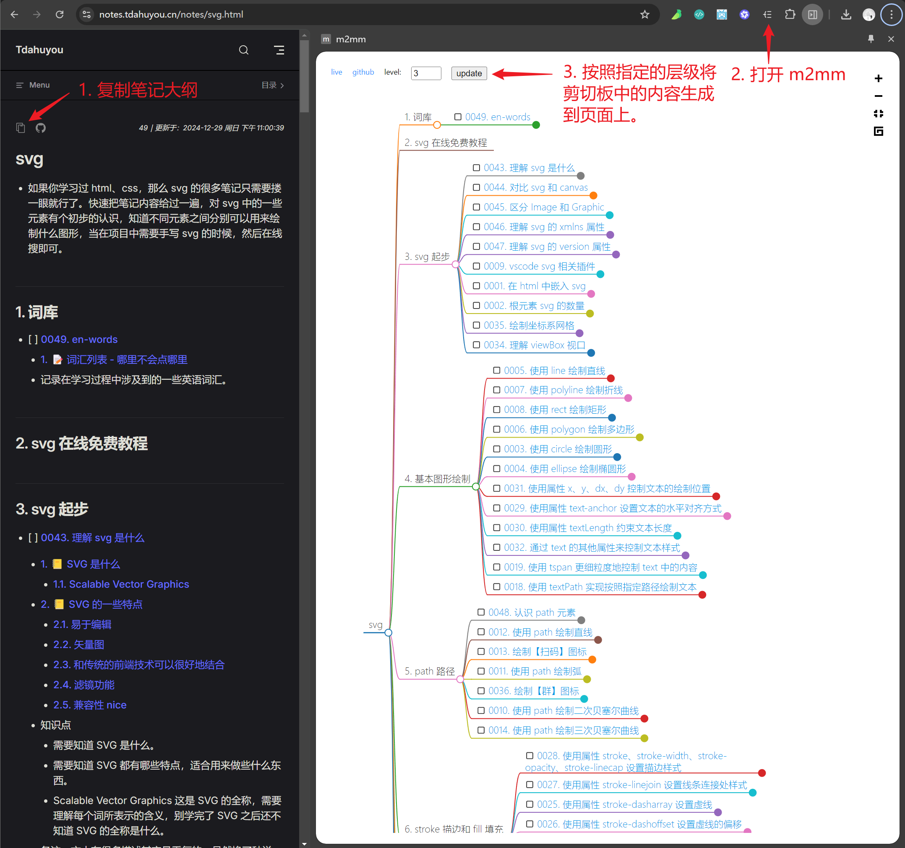

# m2mm

- m2mm（markdown to markmap）是一款将无序列表形式的 markdown 内容转为 markmap 思维导图格式的工具。
- 转换结果是只读的，主要作为预览用。
- 编写 m2mm 的初衷是为了让自己的笔记大纲能够以思维导图的形式来呈现，以便笔记大纲的预览。

## 🔗 在线访问

- https://m2mm.tdahuyou.cn/
- 可在电脑、平板、手机上访问。

## 🔗 chrome 插件

- https://chromewebstore.google.com/detail/m2mm/efagcmmcgdofnhlpajgdpfdmicmkjkda?authuser=0&hl=zh-CN

## 💻 基本使用流程

- 
  - 该截图访问的文档链接：https://notes.tdahuyou.cn/notes/svg.html
- 

## 📦 build

- 可自行根据需求做扩展，clone 代码后直接 build，然后手动加载到 chrome 中调试。

```bash
npm run build
```


